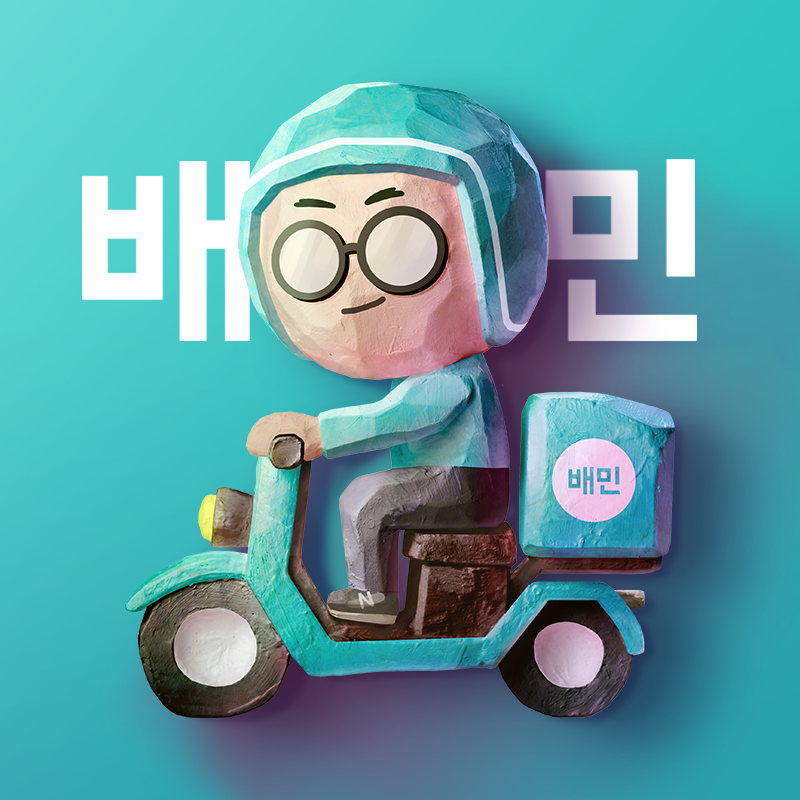

# MAP(Make a Page!)
**made by Group2 (김용민, 양선주, 정민성, 조윤나)**
## 구현하려고 한 것 (데스트탑 기준)

https://www.baemin.com/

1. 배달의 민족 메인페이지
2. 배달의 민족 네이버 블로그
3. 배달의 민족 페이스북
4. 배달의 민족 인스타그램
---
## 배달의 민족 메인페이지

### Detail
- menu bar를 한 줄에 정렬하기 위해 <div>태그 안에 <span>태그로 영역 분리
- fontawesome 사이트의 아이콘 html 링크(i class) 적용 -> 해당 사이트 link href 필요
- button 테두리 둥글게 하기 위해 border-radius : 26px 적용
- 배민 사이트와 동일하게 텍스트 및 이미지를 중앙에 배치하기 위해 flex display 활용
### Difficulties
- 이미지 파일을 배경으로 설정 시 위에 아이콘을 올리면 화면 해상도가 깨지는 문제 발생
- 왼쪽 부분 정렬을 맞추면 오른쪽의 아이콘들이 옆으로 밀려나는 문제 발생
---
## 배달의 민족 네이버 블로그

### Detail
- meta 정보 : title, h1, meta description 등을 추가하여 SEO를 고려함
- 색 : rgba()를 사용해 투명도를 조절, 한 태그에 span 태그를 사용하여 일부만 색을 변경, 글씨가 두꺼워야하는 곳은 font-weight: bold를 사용
- 배치 : body의 width를 제한해 element들이 그 안으로 들어오게 설정, div 태그를 사용해 구역을 나눠 필요한 부분만 flex display 적용, table 태그를 사용하여 element들을 배치
- 포인터 : 누를 수 있는 element에 커서를 가져다대면 cursor:pointer를 사용하여 커서가 손가락 모양으로 변하게 설정, 글씨들은 색이 변하거나 밑줄이 그어지게 함(text-decoration: underline)
- 링크 : 유튜브 버튼을 클릭하면 배달의 민족 유튜브로 넘어감(button type="button" onClick="window.open('링크')") -> 다른 탭에 열리게 함
### Difficulty
- element들을 구조화시킬 때 어떤 태그를 사용해서 구조화해야할지 어려웠음(왼쪽 바를 figure태그를 사용해 나눴는데 맞는지 모르겠음)
- 완전하게 효율적인 코드가 아닌듯함(inline style을 많이 사용함)
- element들의 크기를 맞추기가 어려웠음
---
## 배달의 민족 페이스북
# facebook page 설명

우선 <html> 태그에 대한 전체적인 width, height, font-famliy를 설정하고 각 요소에서 오버라이딩


## 사진 동그랗게 만들기

```html
<div class="card-title">
    <div class="card-div">
        
    </div>
    <div class="card-name">배달의 민족</div>
</div>
```

```css
.card-title {
    width: 100%;
    display: inline-flex;
}

.card-div {
    width: 15%;
    margin: 10px;
    border-radius: 70%;
    overflow: hidden;
    justify-content: flex-start;
}
```

## div 그라데이션 설정

```css
/* 배경 그라데이션, %로 비율 지정 */
background: linear-gradient(#98e9ff, #ffffff 40%);
```

## 메뉴 목록에 마우스 올릴때 효과 및 ‘홈’만 선택되어있는 채로 만들어두기

```css
.list>*:hover{
    color: #3875f8;
    border-bottom: solid #3875f8 2px;
}

#selected{
    color: #3875f8;
    border-bottom: solid #3875f8 2px;
}
```

---


## 상단바 고정

```css
Position: sticky; 
top:0px;
```

## 동영상 유튜브에서 가져오기

```html
<div>
    <iframe src="https://www.youtube.com/embed/UeiXoz89XuM" frameborder="0" width="100%"></iframe>
</div>
```

## 사진 배치 - 표

```html
<table>
    <tr>
        <td class="td-img"></td>
        <td class="td-img"></td>
        <td class="td-img"></td>
    </tr>
    <tr>
        <td class="td-img"></td>
        <td class="td-img"></td>
        <td class="td-img"></td>
    </tr>
</table>
```

```css
td {
    font-size: 0.5rem;
    text-align: center;
}

.td-img {
    border: solid #d8d8d8 1px;
    border-radius: 5px;
}
```

---

## 아쉬운 점

- form css가 부족하다
- 이미지 끼리 겹친 효과를 내지 못했다
- 피드가 계속해서 올라가고 내려가는 부분 구현 안된다
- 좋아요 및 댓글 관련 부분, 올린지 얼마나 됐는지 알려주는 부분 제작 못 함
---
## 배달의 민족 인스타그램

### 기획의도
배달의민족 인스타그램 페이지를 구현하려고 했으나 데스크톱으로 접속이 불가하여 부득이하게
마스코트인 독고배달의 인스타그램을 상상해 보면서 구현했습니다.
### Detail
- shortcut icon을 사용하여 웹브라우저 탭에 이미지를 추가
- z-index를 사용하여 HTML 문서 상에서 먼저 나온 element를 나중에 나온 element보다 앞으로 나오게 함
- border-radius를 사용하여 프로필 이미지를 둥글게 처리
- transform: translateY(-2px)를 사용하여 커서를 댔을 때 눌리는 느낌을 줌
### 느낀 점
처음 해보는 작업이어서 많이 어려웠지만 팀원분들이 적극적으로 도와주셔서 구현할 수 있었습니다.

